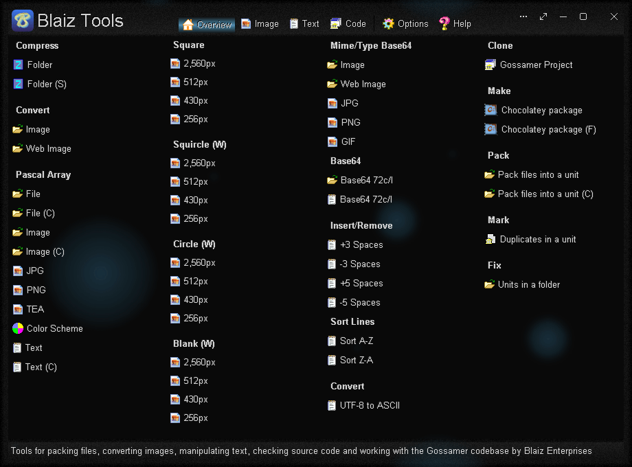
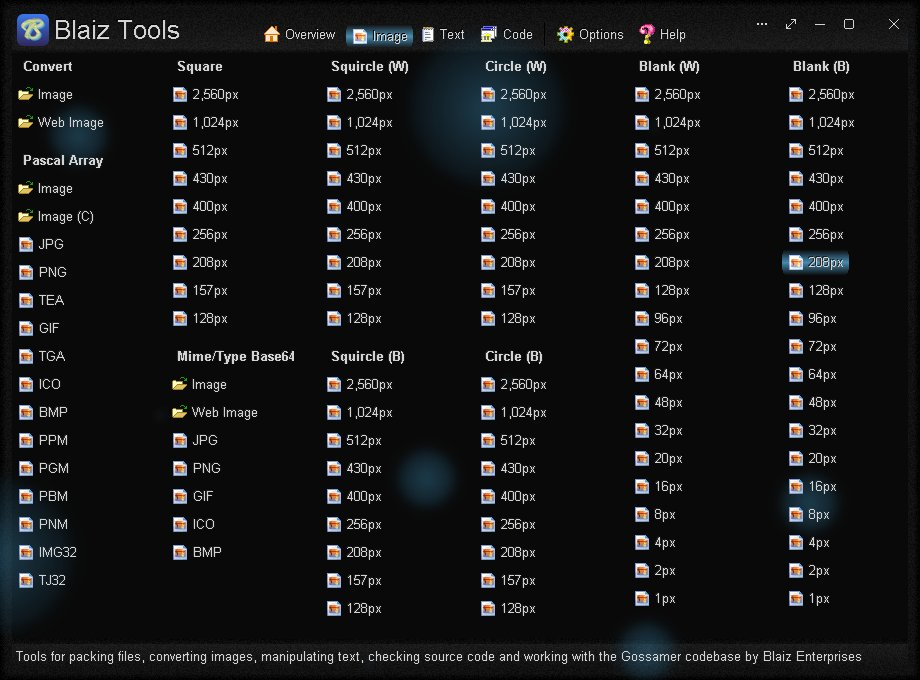
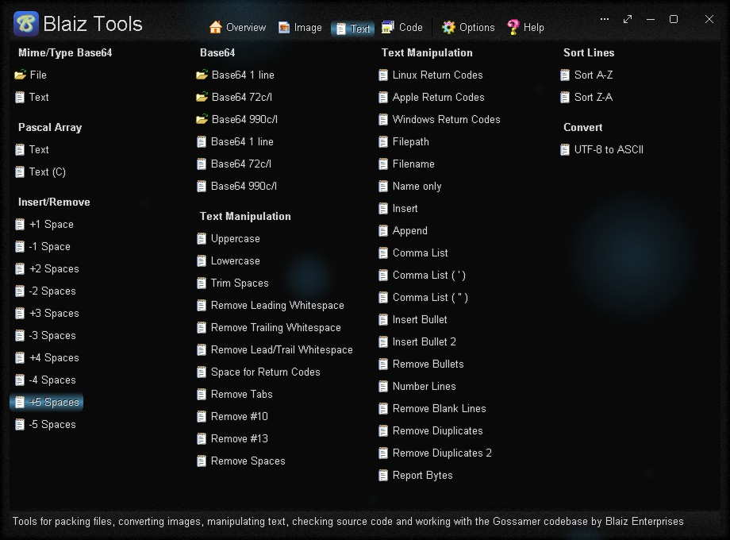
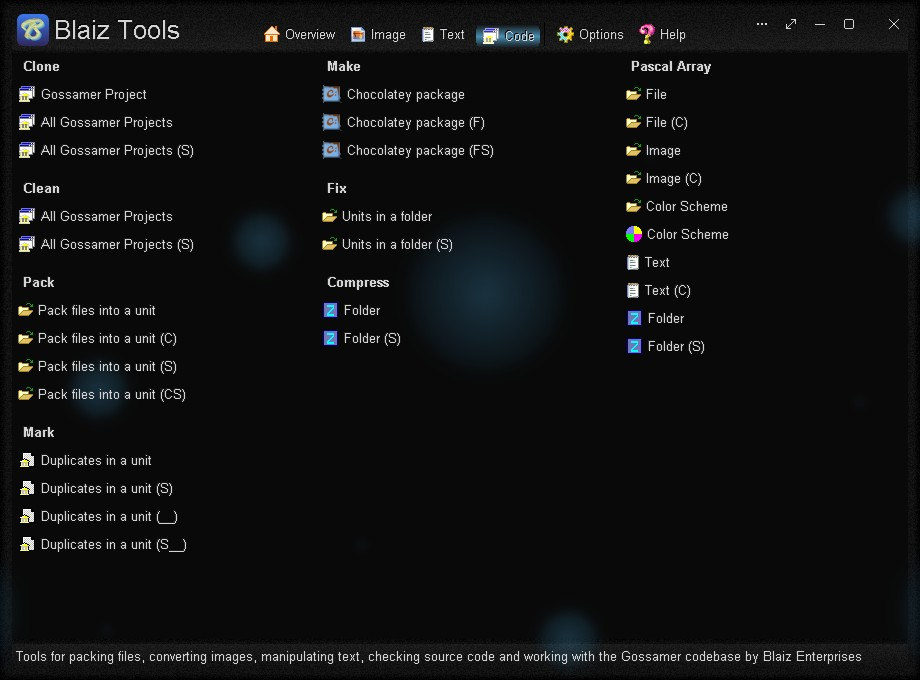
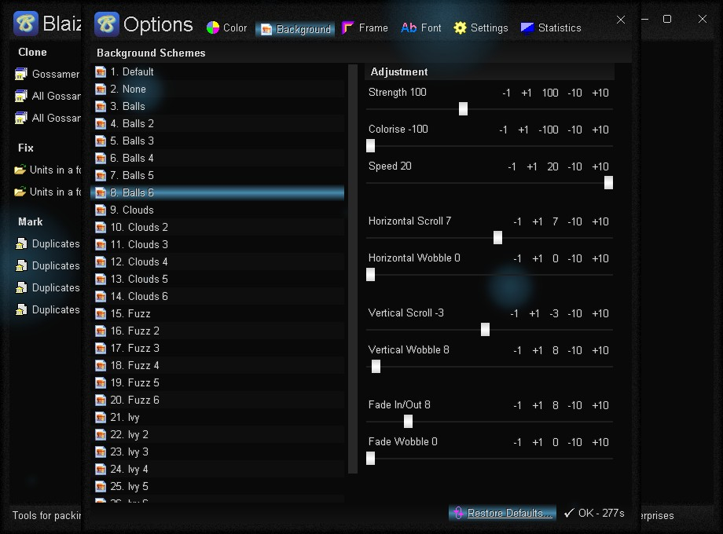
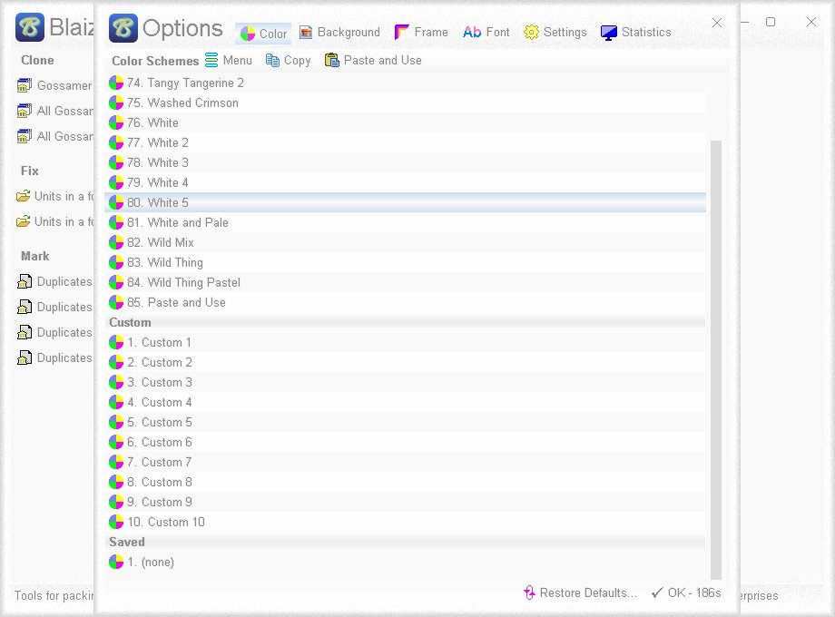

# Blaiz Tools
Tools for packing files, converting images, manipulating text, checking code and working with the Gossamer codebase and app source code.

# Features
* Version 1.00.2382
* Fast, one-click tools for common tasks
* Pack a file, image or text into a binary Pascal array for direct inclusion in source code
* Indent blocks of text (or remove indents) by 1-5 spaces for code styling
* Clone a Gossamer project to a Lazarus project and use one common source code for both projects - supports Borland Delphi 3.0 (Build 5.83) as source and Lazarus 2.2.6 as target
* Convert an image file between these formats: PNG, GIF, JPG, JIF, JPEG, TJ32, BMP, ICO, CUR, ANI, TEA, TGA, PPM, PGM, PBM, XBM and IMG32
* Convert image into mime/type base64 text
* A wide variety of tools to manipulate an image or text held in Clipboard
* List lines of text in ascending (A-Z) or descending (Z-A) order
* Remove leading and trailing whitespace from each line of text
* Remove duplicate lines of text
* Transform a Clipboard image into an auto-cropped, high-resolution, icon ready image in one of three shapes: square, squircle or circle
* Pack files in A-Z order as source code into a Pascal unit (*.pas) using named const arrays, with file data easily accessible from a fuss-free function, including file path, name, compression state, memory pointer and data length
* Fix multiple Pascal units in the same folder and/or sub-folders: remove bad return codes (#10#10 and #13#13) and invalid characters (#0..#31 except for #9, #10 and #13)
* Mark Pascal procedures and functions duplicated in other units with a comment, scanning the same folder and/or sub-folders
* Options Window - Easily change app color, font and settings
* Portable

